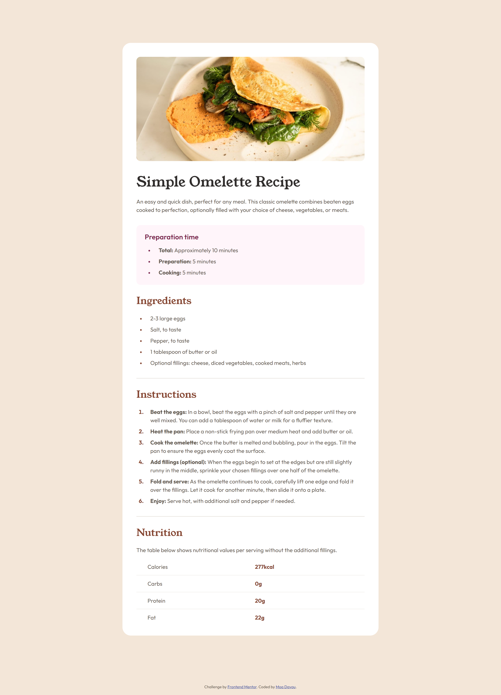

# Frontend Mentor - Recipe page solution

This is a solution to the [Recipe page challenge on Frontend Mentor](https://www.frontendmentor.io/challenges/recipe-page-KiTsR8QQKm). Frontend Mentor challenges help you improve your coding skills by building realistic projects.

## Table of contents

- [Overview](#overview)
  - [Screenshot](#screenshot)
  - [Links](#links)
- [My process](#my-process)
  - [Built with](#built-with)
  - [What I learned](#what-i-learned)
  - [Continued development](#continued-development)
  - [Useful resources](#useful-resources)
- [Author](#author)

## Overview

### Screenshot



### Links

- Repository URL: [GitHub](https://github.com/moadavou/recipe-page)
- Live Site URL: [GitHub Pages](https://moadavou.github.io/recipe-page/)

## My process

### Built with

- Semantic HTML5 markup
- CUBE CSS
- Flexbox
- CSS Grid
- Mobile-first workflow

### What I learned

My biggest takeaway from this challenge is **CSS utility classes**. I took another approach than I usually do and focused on using utility classes and **CUBE CSS methodology** to reduce repeated CSS. It is a smaller project, and it won't ever grow. However, I tried to write my code so that the project could expand without causing issues in the future.

This mind shift was difficult in the beginning. But overall, I like this approach more than what I did before. The code is more fluid, easier to read, and to change (_if needed_).

**Here is an example of how I structerd the code:**

```html
<h2 class="text-primary-nutmeg">Ingredients</h2>
```

```css
:root {
  --clr-primary-nutmeg: hsl(14, 45%, 36%);
}

.text-primary-nutmeg {
  color: var(--clr-primary-nutmeg);
}
```

**Notes for the future:**

- Place the utility classes last in the CSS code - it should overwrite everything else.
- I used utility classes for `colour`, `background-color`, `font-weight`, `font-size`, `font-family`, and spacing (named flow). Other styling I did in the CSS file.\*
- Use "|" to differentiate utility classes and other classes.

\*_Mixing utility classes with CSS feels like a good idea. My HTML won't be full of a million classes, and I don't have to repeat basic styling in my CSS file._

### Continued development

I want to continue to focus on trying out this utility class approach. It feels like a more professional way to write code - I'm not 100% sure.

I also want to take some time to learn more about CUBE CSS. I have implemented some of the methodology in this project, but I feel like I have a lot more to learn.

### Useful resources

- [Build a responsive website with HTML & CSS](https://www.youtube.com/playlist?list=PL4-IK0AVhVjNDRHoXGort7sDWcna8cGPA) - This series by Kevin Powell on YouTube helped me learn how to use utility classes. I (more or less) copied what he did.

## Author

- Frontend Mentor - [@moadavou](https://www.frontendmentor.io/profile/moadavou)
- GitHub - [@moadavou](https://github.com/moadavou)
